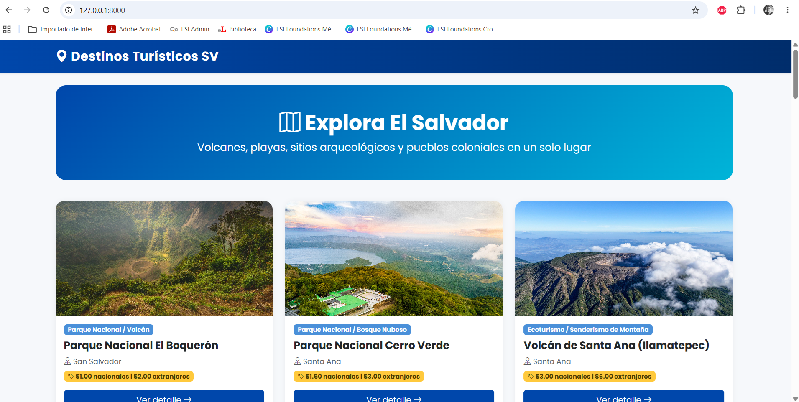
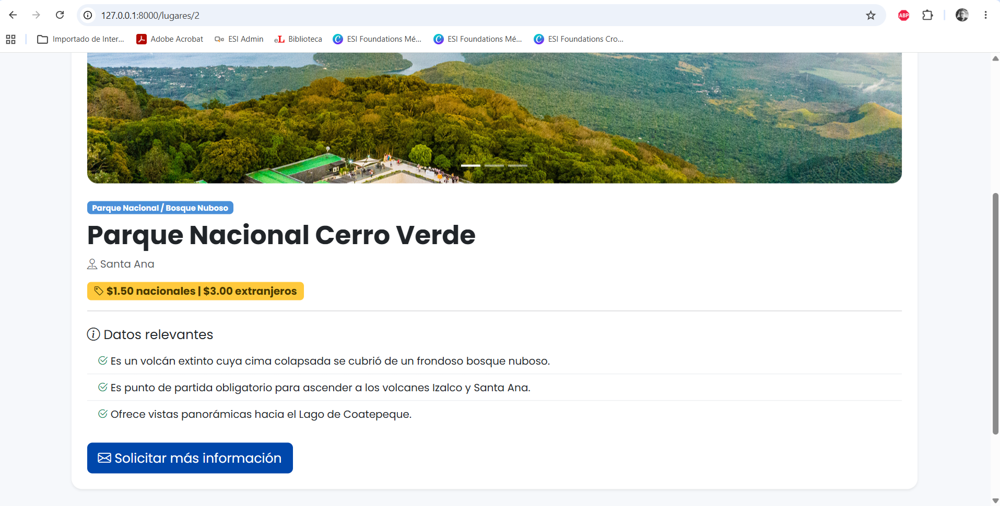
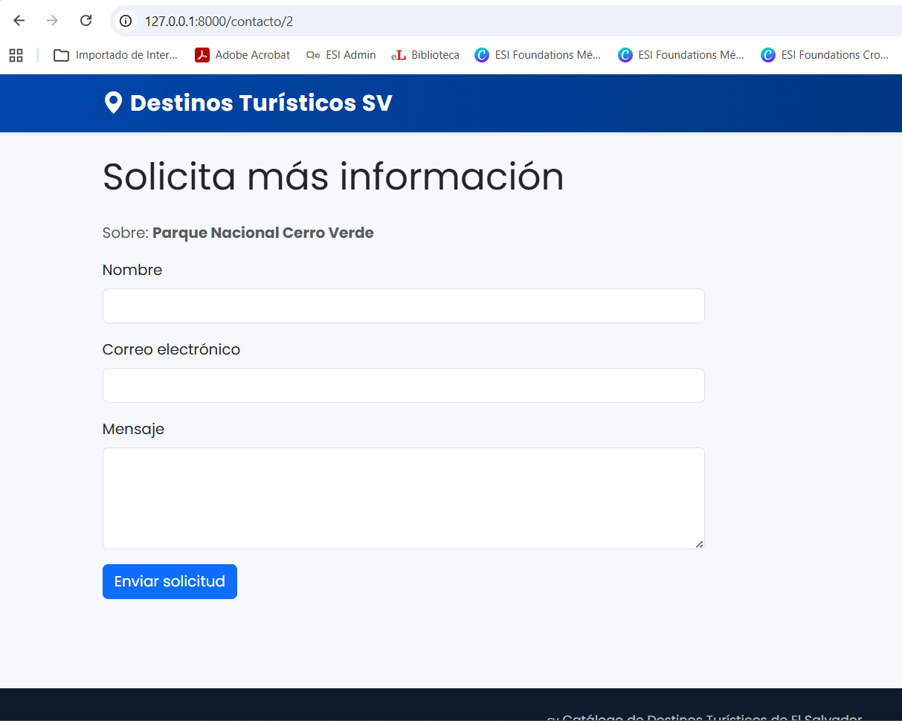

# Catálogo Turístico de El Salvador — Laravel MVC

Aplicación web que implementa el patrón MVC en Laravel para listar y mostrar
detalles de destinos turísticos de El Salvador, usando un archivo JSON como
fuente de datos.

## Instalación

\`\`\`powershell
git clone <url-del-repo>
cd destinos-turisticos
composer install
copy .env.example .env
php artisan key:generate
php artisan serve
\`\`\`

Luego abre `http://localhost:8000`.

## Flujo MVC implementado

1. **Ruta** (`routes/web.php`): recibe la petición HTTP (GET/POST) y la asigna
   a un método de un controlador.
2. **Controlador** (`LugarController`, `ContactoController`): recibe la
   petición, solicita los datos al Modelo, y decide qué vista renderizar.
3. **Modelo** (`app/Models/Lugar.php`): encapsula el acceso a los datos,
   leyendo y escribiendo `storage/app/data/lugares.json` y
   `storage/app/data/contactos.json`.
4. **Vista** (`resources/views/...`): recibe los datos del controlador
   (mediante `compact()`) y genera el HTML final que se envía al navegador.

   "Se usó php artisan make:model Lugar para generar la estructura base del Modelo. Como este proyecto no usa base de datos sino un archivo JSON como fuente de datos, se removió la herencia de Illuminate\Database\Eloquent\Model y se implementó el acceso a datos mediante métodos estáticos que leen/escriben con la fachada Storage."

### Ciclo de vida de una petición (ejemplo: ver detalle de un lugar)

`Navegador → Ruta (/lugares/{id}) → LugarController::show() → Lugar::find($id)
→ storage/app/data/lugares.json → Controlador arma los datos → vista
lugares/show.blade.php → HTML → Navegador`

## Capturas de pantalla

## Datos de prueba

Los datos están en `storage/app/data/lugares.json`.

## Nota sobre datos de prueba

Laravel ignora por defecto todo el contenido de `storage/app/` mediante
`storage/app/.gitignore`. Para este proyecto se agregó una excepción
(`!private/data/`) que permite versionar el archivo `lugares.json`,
ya que funciona como la fuente de datos de la aplicación y debe estar
disponible al clonar el repositorio.
